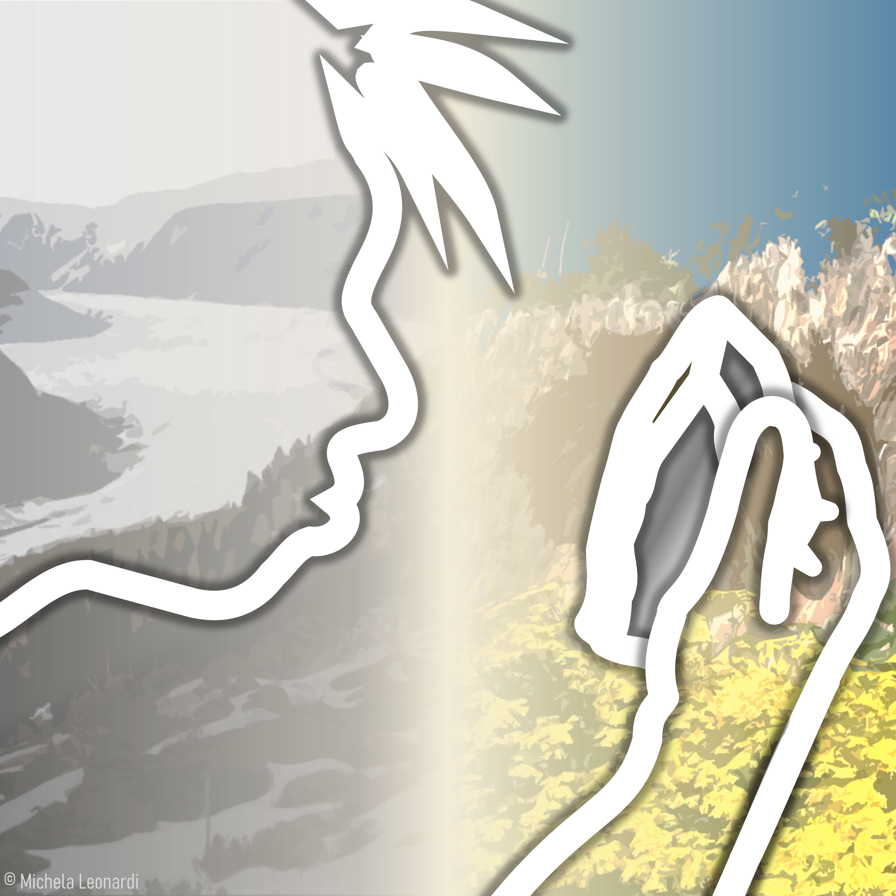

# Credits for files in "img" folder

### Banners

Add information

Owner: [Andrea Manica](../people/andrea_manica.html). 
Design by [Michela Leonardi](https://michelaleonardi.netsons.org/), 
licence [CC BY-NC-ND 4.0](https://creativecommons.org/licenses/by-nc-nd/4.0/)

Photo by [Martin & Ondrej Pelanek](https://www.phototrip.cz/). 
This image is provided exclusively for use by the group, free of charge, for non-commercial and research-related purposes.
Licence: Custom – Free for internal group use, no redistribution without permission.

Photo by [Martin & Ondrej Pelanek](https://www.phototrip.cz/). 
This image is provided exclusively for use by the group, free of charge, for non-commercial and research-related purposes.
Licence: Custom – Free for internal group use, no redistribution without permission.

Add information

[Photo](https://www.pexels.com/photo/parrots-perched-on-brown-wooden-surface-1599452/) 
by [Magda Ehlers](https://www.pexels.com/@magda-ehlers-pexels/) 
on [pexels](https://www.pexels.com/). 
Free for commercial and non-commercial use, with or without 
attribution ([licence](https://www.pexels.com/license/)). 

sarah-kilian-K3j9FE0Kfms-unsplash

[Photo](https://unsplash.com/photos/puffin-illustration-K3j9FE0Kfms) 
by [Sarah Kilian](https://unsplash.com/@rojekilian) 
on [unsplash](https://unsplash.com/photos). 
free for commercial and non-commercial use, with or without 
attribution ([licence](https://unsplash.com/license)). 

pexels-vova-krasilnikov-2713133

[Photo](https://www.pexels.com/photo/group-of-brown-meerkats-2713133/) 
by [Vova Krasilnikov](https://www.pexels.com/@vovaflame/gallery/) 
on [pexels](https://www.pexels.com/). 
Free for commercial and non-commercial use, with or without 
attribution([licence](https://www.pexels.com/license/)). 

by [Cristina Gottardi](https://unsplash.com/@cristina_gottardi) 
on [unsplash](https://unsplash.com/photos). 
Free for commercial and non-commercial use, with or without attribution:
[licence](https://unsplash.com/license). 

by [Michela Leonardi](https://michelaleonardi.netsons.org/), 
licence [CC BY-NC-ND 4.0](https://creativecommons.org/licenses/by-nc-nd/4.0/)

by [Michela Leonardi](https://michelaleonardi.netsons.org/), 
licence [CC BY-NC-ND 4.0](https://creativecommons.org/licenses/by-nc-nd/4.0/)

owner: [Andrea Manica](../people/andrea_manica.html). 
Pictures by [Julia Spaet](https://www.instagram.com/juliaspaet/), [Michela Leonardi](https://michelaleonardi.netsons.org/);
graphics and logo by [Michela Leonardi](https://michelaleonardi.netsons.org/). 
Licence [CC BY-NC-ND 4.0](https://creativecommons.org/licenses/by-nc-nd/4.0/)

Owner: [Andrea Manica](../people/andrea_manica.html). 
Picture by [Michela Leonardi](https://michelaleonardi.netsons.org/), 
licence [CC BY-NC-ND 4.0](https://creativecommons.org/licenses/by-nc-nd/4.0/)

[Photo](https://www.phototrip.cz/image/albatros-sanforduv-diomedea-sanfordi-northern-royal-albatros7657?pid=679) 
by [Martin & Ondrej Pelanek](https://www.phototrip.cz/). 
This image is provided exclusively for use by the group, free of charge, for non-commercial and research-related purposes.
Licence: Custom – Free for internal group use, no redistribution without permission.

Owner: [Andrea Manica](../people/andrea_manica.html). 
Pictures, graphics and design by [Michela Leonardi](https://michelaleonardi.netsons.org/), 
licence [CC BY-NC-ND 4.0](https://creativecommons.org/licenses/by-nc-nd/4.0/)

Owner: [Andrea Manica](../people/andrea_manica.html). 

Owner: [Andrea Manica](../people/andrea_manica.html). 

### Square pictures

Photo by [Martin & Ondrej Pelanek](https://www.phototrip.cz/). 
This image is provided exclusively for use by the group, free of charge, for non-commercial and research-related purposes.
Licence: Custom – Free for internal group use, no redistribution without permission.

Add information

Add information

Add information

Owner: [Andrea Manica](../people/andrea_manica.html). 
Pictures, graphics and design by [Michela Leonardi](https://michelaleonardi.netsons.org/), 
licence [CC BY-NC-ND 4.0](https://creativecommons.org/licenses/by-nc-nd/4.0/)

Owner: [Andrea Manica](../people/andrea_manica.html). 
Pictures, graphics and design by [Michela Leonardi](https://michelaleonardi.netsons.org/), 
licence [CC BY-NC-ND 4.0](https://creativecommons.org/licenses/by-nc-nd/4.0/)

### Icons

Source: [fontawesome free](https://fontawesome.com/icons/user?f=classic&s=solid),
licence: [fontawesome](https://fontawesome.com/license/free) [CC BY 4.0](https://creativecommons.org/licenses/by/4.0/)

Source: [fontawesome free](https://fontawesome.com/icons/user?f=classic&s=solid),
licence: [fontawesome](https://fontawesome.com/license/free) [CC BY 4.0](https://creativecommons.org/licenses/by/4.0/)

Add information

### Logos

Owner: [Andrea Manica](../people/andrea_manica.html). 
Design by [Michela Leonardi](https://michelaleonardi.netsons.org/), 
licence [CC BY-NC-ND 4.0](https://creativecommons.org/licenses/by-nc-nd/4.0/)

Owner: [Andrea Manica](../people/andrea_manica.html). 
Design by [Michela Leonardi](https://michelaleonardi.netsons.org/), 
licence [CC BY-NC-ND 4.0](https://creativecommons.org/licenses/by-nc-nd/4.0/)

Owner: [Andrea Manica](../people/andrea_manica.html). 
Design by [Michela Leonardi](https://michelaleonardi.netsons.org/), 
licence [CC BY-NC-ND 4.0](https://creativecommons.org/licenses/by-nc-nd/4.0/)

Owner: [Andrea Manica](../people/andrea_manica.html). 
Design by [Michela Leonardi](https://michelaleonardi.netsons.org/), 
licence [CC BY-NC-ND 4.0](https://creativecommons.org/licenses/by-nc-nd/4.0/)

 

Owner: [Andrea Manica](../people/andrea_manica.html). 
Design by [Michela Leonardi](https://michelaleonardi.netsons.org/), 
licence [CC BY-NC-ND 4.0](https://creativecommons.org/licenses/by-nc-nd/4.0/)

owner: [Andrea Manica](../people/andrea_manica.html)
design by [Michela Leonardi](https://michelaleonardi.netsons.org/)
licence: [CC BY-NC-ND 4.0](https://creativecommons.org/licenses/by-nc-nd/4.0/)

Owner: [Andrea Manica](../people/andrea_manica.html). 
Design by [Michela Leonardi](https://michelaleonardi.netsons.org/), 
licence [CC BY-NC-ND 4.0](https://creativecommons.org/licenses/by-nc-nd/4.0/)

Add information

Owner: [Andrea Manica](../people/andrea_manica.html). 
Design by [Michela Leonardi](https://michelaleonardi.netsons.org/), 
licence [CC BY-NC-ND 4.0](https://creativecommons.org/licenses/by-nc-nd/4.0/)

Owner: [Andrea Manica](../people/andrea_manica.html). 
Design by [Michela Leonardi](https://michelaleonardi.netsons.org/), 
licence [CC BY-NC-ND 4.0](https://creativecommons.org/licenses/by-nc-nd/4.0/)

Owner: [Andrea Manica](../people/andrea_manica.html). 
Design by [Michela Leonardi](https://michelaleonardi.netsons.org/), 
licence [CC BY-NC-ND 4.0](https://creativecommons.org/licenses/by-nc-nd/4.0/)

Owner: [Andrea Manica](../people/andrea_manica.html). 
Design by [Michela Leonardi](https://michelaleonardi.netsons.org/), 
licence [CC BY-NC-ND 4.0](https://creativecommons.org/licenses/by-nc-nd/4.0/)

Owner: [Andrea Manica](../people/andrea_manica.html). 
Design by [Michela Leonardi](https://michelaleonardi.netsons.org/), 
licence [CC BY-NC-ND 4.0](https://creativecommons.org/licenses/by-nc-nd/4.0/)
